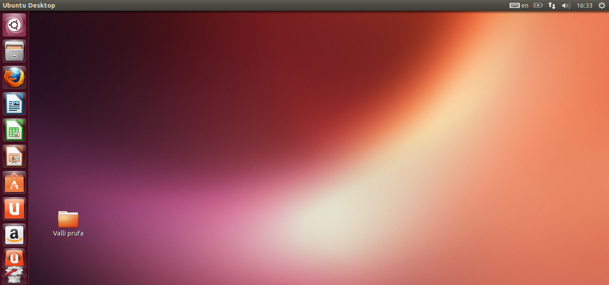

#Open Source

Meðlimir hóps:
+ Xxxx Xxxx(Datt út úr hópnum sökum tæknivandamála)  
+ Valgeir Már Sturluson

## 1. Linux uppsetning
Okkur gekk ágætlega að setja inn Ubuntu.  Við náðum í Virtualbox, settum það
upp. það gekk auðveldlega og svo náðum við í Ubuntu13.04 og settum upp.
Það gekk ekki vel í byrjun, vildi ekki keyra eðlilega fyrst en svo duttum 
við inn á það ráð að breyta stillingum fram og til baka, þá keyrði forritið.  
Nauðsynlegt var að afhaka við "usb" eins og margir lentu í.  
En eftir það var samt sem áður nauðsynlegt að breyta einhverri stillingu til 
þess að Ubuntu keyrði upp. En það dugði eftir nokkar tilraunir.   
 
*Þetta er viðbót:Þegar leið á tókst félaga mínum ekki að keyra upp Ubuntu 
sama hvaða ráðum var beitt og sagði hann sig frá verkefninu.

## 2. Uppsetning á vim & git
Uppsetning á Vim og Git gekk eins og í sögu. Notaði gefnar command línur    
til þess arna og það gekk vel. Einnig gekk vel að búa til SSH key og tengja hann inni á github.  En það reyndi ekki á það hjá félaganum sökum vandræða.   
En hann hafði búið til account á github og ég hafði bætt honum við sem  
collaborator.  

## 3. Unnið með Git (1. hluti)
Það gekk áfallalaust að stofna account á github og þar fann ég INTOPrufa 
verkefnið fljótt og smellti á "fork".  
Svo var auðvelt að klóna forkuðu útgáfuna á mína tölvu með skipuninni: 
"git clone "hlekkur á skjal".
Svo eftir ítarlega yfirfer á vim þá gekk vel að gera breytingu á NIM.cpp   
svo og einnig að búa til commit með eigin lýsingu á hvað var gert.
	Svo var gefin skipunin "git push origin master" og sá ég svo á 
github.com að forkaða útgáfan okkar innihélt þessi commit.
 
Hlekkur á repository okkar er: https://github.com/Valli78/INTOPrufa

## 4. Uppsettur hugbúnaður

Á minni vél er það helst að telja að ég er með eftirfarandi 
Open Source forrit:

Virtualbox 4.3.0 
Leyfi:GPL V2   
Source Code:    
https://virtualbox.org/browser/vbox/trunk

Ubuntu 13.04.
Leyfi: GNU GPL   
Source Code:   
http://cdimage.ubuntu.com/releases/13.04/release/source/      

Codeblocks 12.11
Leyfi:GNU GPL   
Source Code:    
http://prdownload.berlios.de/codeblocks/codeblocks_12.11-1.tar.gz  

## 5. GIT  
Þetta var mjög skemmtilegt verkefni þegar leið á og manni fannst maður   
læra mjög mikið á mjög skömmum tíma.  En sem áður þá er maður ekki viss   
hvort maður sé að gera rétta hluti og er í smá óvissu á leiðinni.  
En mjög gaman að prófa Linux í fyrsta skipti og kynnast fyrirbærum   
eins og git og vim, og langar mig að læra meira á þau tól.
